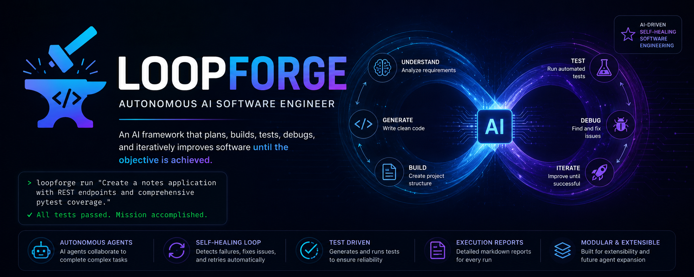

<p align="center">
  
</p>

<h1 align="center">🚀 LoopForge</h1>

<p align="center">
  <b>An autonomous AI framework that plans, builds, tests, debugs, self-corrects, and iterates until the task is complete.</b>
</p>

# 🚀 LoopForge


> **An autonomous AI framework that plans, builds, tests, debugs, self-corrects, and iterates until the task is successfully completed.**

LoopForge demonstrates how multiple AI-driven workflows can collaborate to solve complex engineering tasks with minimal human intervention. Instead of stopping after generating code, it verifies its own work, detects failures, applies fixes, and retries until the project succeeds.

---

## ✨ Features

* 🧠 AI-powered software generation from a single prompt
* 🔄 Autonomous execution loop with iterative improvement
* 🧪 Automatic test generation and execution using `pytest`
* 🐞 Self-healing workflow that analyzes failures and fixes code
* 📄 Execution report generation for every run
* 📁 Dynamic project scaffolding using FastAPI
* 🔧 Modular architecture designed for future agent expansion

---

## 🔥 Example Workflow

```text
User Prompt
      │
      ▼
Generate Project
      │
      ▼
Write Source Files
      │
      ▼
Run Tests
      │
      ▼
Tests Failed?
 ┌───────────────┐
 │      Yes      │
 ▼               │
Analyze Errors   │
      │          │
      ▼          │
Fix Code         │
      │          │
      └──────────┘
           │
           ▼
Run Tests Again
      │
      ▼
All Tests Pass
      │
      ▼
Generate Execution Report
```

---

## 🏗️ Current Capabilities

LoopForge can currently:

* Generate FastAPI applications from natural language prompts
* Automatically create project files
* Generate pytest test suites
* Execute the generated tests
* Detect failures
* Repair broken implementations
* Re-run tests until successful
* Produce a Markdown execution report

Example prompt:

> **Create a REST API for a bookstore with create, list, update, and delete endpoints, then generate tests and automatically fix any issues until all tests pass.**

---

## 📂 Project Structure

```text
LoopForge/
│
├── agents/
├── core/
├── tools/
├── memory/
├── generated_apps/
├── main.py
├── requirements.txt
└── README.md
```

---

## 🚀 Getting Started

### Clone the repository

```bash
git clone https://github.com/<your-username>/loopforge.git
cd loopforge
```

### Create a virtual environment

```bash
python -m venv .venv
```

### Activate it

**Windows**

```bash
.venv\Scripts\activate
```

**macOS/Linux**

```bash
source .venv/bin/activate
```

### Install dependencies

```bash
pip install -r requirements.txt
```

### Configure your API key

Create a `.env` file:

```env
OPENAI_API_KEY=your_api_key
OPENAI_MODEL=gpt-5.5
```

---

## ▶️ Run LoopForge

```bash
python main.py
```

You can choose between:

```
1. Agent Loop
2. Auto Software Engineer
```

---

## 🧪 Sample Demo

Input:

```
Create a notes application with REST endpoints and comprehensive pytest coverage.
```

LoopForge will:

* Generate the application
* Generate tests
* Execute pytest
* Detect failures
* Fix broken code
* Re-run tests
* Produce an execution report

Typical output:

```
22 tests generated
2 tests failed
AI fixed missing endpoint
22 tests passed
Execution report generated
```

---

## 📄 Generated Report

Each execution creates a report similar to:

```
generated_apps/dynamic_app/loopforge_report.md
```

The report includes:

* User objective
* Execution status
* Number of attempts
* AI-generated summary
* Test results

---

## 🛣️ Roadmap

* [x] AI project generation
* [x] Automated test execution
* [x] Self-healing fix loop
* [x] Execution reporting
* [ ] Dynamic planner agent
* [ ] Multi-agent orchestration
* [ ] Persistent memory
* [ ] Git integration
* [ ] Docker execution sandbox
* [ ] CI/CD pipeline generation
* [ ] Autonomous code reviews
* [ ] Multi-language project support

---

## 🤝 Contributing

Contributions, ideas, and feedback are welcome. Feel free to open an issue or submit a pull request.

---

## 📜 License

This project is released under the MIT License.

---

## ⭐ Vision

LoopForge is being built as an open framework for autonomous software engineering and agentic workflows. The long-term goal is to enable AI systems that don't just generate code they plan, verify, debug, iterate, and continuously improve until the task is complete.
